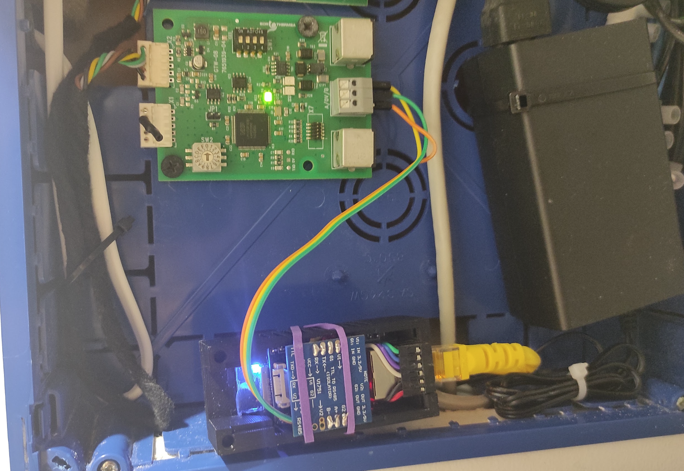
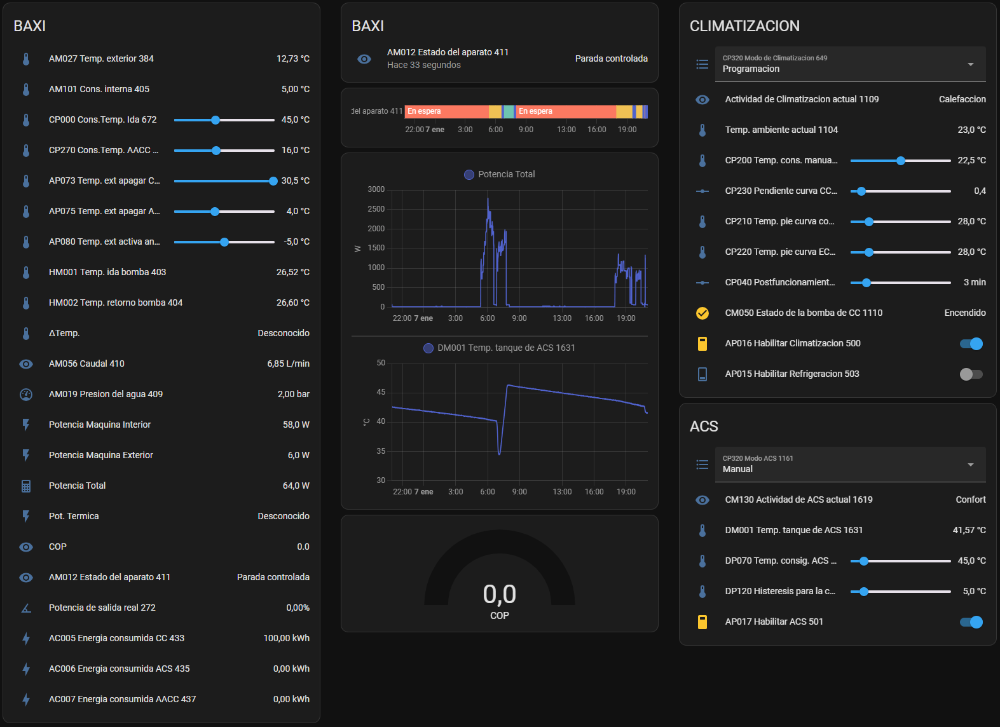

# Welcome to my second project!

Hi!
This is Imanol82.
Here you have my second project.
With this project we can connect any Baxi/Dietrich/Remeha Aerothermal with Home Assistant using an ESP32. 
For this we will need the GTW-08 that converts the RBus into Modbus.

My system has 2 Zones. Zone 1 is the HVAC and Zone 2 is the DHW

It is the same system that I used in my first project, but changing the Modbus-TCP for an ESP32.

Over time we will complete it more.

Thanks!

# New version 0.2:
The idea is to use both the DHW and the Air Conditioning in manual mode, and use the Home Assistant scheduler to make programs, raise and lower the temperatures...

So I have changed the yaml to the minimum parameters that I think are interesting and I have configured a new dashboard.
The next thing will be to create 2 climate entities, one for the air conditioning and the other for the DHW.


Thank you!

######################

-----------------------------------------------------------------------------------------------------------------------------------

# Installation:

First of all you need a GTW-08 gateway to convert the RBus signal to Modbus:


To read the Modbus signal, I will use an ESP32 with the typical TTL to RS485 reader.
I have used an ESP32 ETH POE, but any will work.:



The wiring diagram:


Now we will only have to create the ESP32 in ESPHome.

ESP32.yaml:
```
substitutions:
  settings_skipped_updates: "30"
  devicename: "baxi_esp"

esphome:
  name: $devicename

esp32:
  board: esp32-c3-devkitm-1
  variant: esp32c3
  framework:
    type: esp-idf
    version: latest
#    platform_version: 6.5.0

external_components:
  - source: 
      type: git
      url: https://github.com/esphome/esphome
      ref: d5bdf2575c151abfad39b6c24c3856395a7d0901
    components:
      - ethernet

# Enable logging
logger:

# Enable Home Assistant API
api:
  encryption:
    key: *************************

ota:
  - platform: esphome
    password: *************************

ethernet:
  id: my_network
  type: DM9051 # W5500
  clk_pin: 7
  mosi_pin: 10
  miso_pin: 3
  cs_pin: 9
  interrupt_pin: 8
  reset_pin: 6
  clock_speed: 20MHz
  manual_ip:
    static_ip: 192.168.***.***
    gateway: 192.168.***.***
    subnet: 255.255.***.***
    dns1: 192.168.***.***

time:
  - platform: homeassistant
    id: homeassistant_time
     
uart:
  id: mod_bus
  tx_pin: GPIO2
  rx_pin: GPIO5
  baud_rate: 9600
  stop_bits: 1

modbus:
  id: baxi_esp_modbus
 
modbus_controller:
  - id: baxi_esp
    address: 0x64
    modbus_id: baxi_esp_modbus
    setup_priority: -10
    update_interval: "15s"
    command_throttle: "50ms"


##############################  ENTITIES  ##############################


##############################  SENSORS  ###############################


sensor:

  - platform: modbus_controller                       #272 PowerActualReceived
    modbus_controller_id: $devicename
    name: "Potencia de salida real 272"   
    address: 272
    register_type: holding
    value_type: U_WORD
    unit_of_measurement: "%"
    accuracy_decimals: 2
    device_class: power_factor
    state_class: measurement
    filters:
      - multiply:  1

  - platform: modbus_controller                       #384 varApTOutside 8-1 
    modbus_controller_id: $devicename
    name: "AM027 Temp. exterior 384"   
    address: 384
    register_type: holding
    value_type: S_WORD
    unit_of_measurement: "°C"
    accuracy_decimals: 2
    device_class: temperature
    state_class: measurement
    filters:
      - multiply:  0.01

  - platform: modbus_controller                       #403 varHpHeatPumpTF 8-1
    modbus_controller_id: $devicename
    name: "HM001 Temp. ida bomba 403"   
    id: hm001_temp_ida_bomba_de_calor_403
    address: 403
    register_type: holding
    value_type: S_WORD
    unit_of_measurement: "°C"
    accuracy_decimals: 2
    device_class: temperature
    state_class: measurement
    filters:
      - multiply:  0.01

  - platform: modbus_controller                       #404 varHpHeatPumpTR 8-1
    modbus_controller_id: $devicename
    name: "HM002 Temp. retorno bomba 404"  
    id: hm002_temp_retorno_bomba_de_calor_404 
    address: 404
    register_type: holding
    value_type: S_WORD
    unit_of_measurement: "°C"
    accuracy_decimals: 2
    device_class: temperature
    state_class: measurement
    filters:
      - multiply:  0.01

  - platform: modbus_controller                       #405 varApInternalSetpoint 8-1
    modbus_controller_id: $devicename
    name: "AM101 Cons. interna 405"   
    address: 405
    register_type: holding
    value_type: U_WORD
    unit_of_measurement: "°C"
    accuracy_decimals: 2
    device_class: temperature
    state_class: measurement
    filters:
      - multiply:  0.01

  - platform: modbus_controller                       #409 varApWaterPressure
    modbus_controller_id: $devicename
    name: "AM019 Presion del agua 409"   
    address: 409
    register_type: holding
    value_type: U_WORD
    unit_of_measurement: "bar"
    accuracy_decimals: 2
    device_class: pressure
    state_class: measurement
    filters:
      - multiply:  0.1

  - platform: modbus_controller                       #410 varApFlowmeter 8-1
    modbus_controller_id: $devicename
    name: "AM056 Caudal 410"   
    id: am056_caudal_410
    address: 410
    register_type: holding
    value_type: U_WORD
    unit_of_measurement: "L/min"
    accuracy_decimals: 2
    device_class: volume_flow_rate
    state_class: measurement
    filters:
      - multiply:  0.01

  - platform: modbus_controller                       #433 varApChEnergyConsumption 24-17
    modbus_controller_id: $devicename
    name: "AC005 Energia consumida CC 433"   
    address: 433
    register_type: holding
    value_type: U_DWORD
    unit_of_measurement: "kWh"
    accuracy_decimals: 2
    device_class: energy
    state_class: measurement
    filters:
      - multiply:  1

  - platform: modbus_controller                       #435 varApDhwEnergyConsumption 24-17
    modbus_controller_id: $devicename
    name: "AC006 Energia consumida ACS 435"   
    address: 435
    register_type: holding
    value_type: U_DWORD
    unit_of_measurement: "kWh"
    accuracy_decimals: 2
    device_class: energy
    state_class: measurement
    filters:
      - multiply:  1

  - platform: modbus_controller                       #437 varApCoolingEnergyConsumption 24-17
    modbus_controller_id: $devicename
    name: "AC007 Energia consumida AACC 437"   
    address: 437
    register_type: holding
    value_type: U_DWORD
    unit_of_measurement: "kWh"
    accuracy_decimals: 2
    device_class: energy
    state_class: measurement
    filters:
      - multiply:  1

  - platform: modbus_controller                       #1104 varZoneTRoom 8-1
    modbus_controller_id: $devicename
    name: "Temp. ambiente actual 1104"   
    address: 1104
    register_type: holding
    value_type: S_WORD
    unit_of_measurement: "°C"
    accuracy_decimals: 1
    device_class: temperature
    state_class: measurement
    filters:
      - multiply:  0.1

  - platform: modbus_controller                       #1631 varDhwTankTemperature 8-1
    modbus_controller_id: $devicename
    name: "DM001 Temp. tanque de ACS 1631"   
    address: 1631
    register_type: holding
    value_type: S_WORD
    unit_of_measurement: "°C"
    accuracy_decimals: 2
    device_class: temperature
    state_class: measurement
    filters:
      - multiply:  0.01


##############################  TEMPLATES  ########################


  - platform: template
    name: "ΔTemp." 
    unit_of_measurement: "°C"
    accuracy_decimals: 2
    device_class: temperature
    state_class: measurement
    lambda: |-
      return (id(hm001_temp_ida_bomba_de_calor_403).state - id(hm002_temp_retorno_bomba_de_calor_404).state);

  - platform: template
    name: "Pot. Termica" 
    unit_of_measurement: "W"
    accuracy_decimals: 2
    device_class: power
    state_class: measurement
    lambda: |-
      return (id(am056_caudal_410).state * 60 * (id(hm001_temp_ida_bomba_de_calor_403).state - id(hm002_temp_retorno_bomba_de_calor_404).state)/1);


##############################  BINARY SENSORS  ########################


binary_sensor:

  - platform: modbus_controller                       #1110 varZonePumpRunning
    modbus_controller_id: $devicename
    name: "CM050 Estado de la bomba de CC 1110"
    address: 1110
    register_type: holding


##############################  SWITCH  ################################


switch:

  - platform: modbus_controller                       #500 parApChEnabled
    modbus_controller_id: $devicename
    name: "AP016 Habilitar Climatizacion 500"
    address: 500
    register_type: holding
    use_write_multiple: True
    bitmask: 1
    
  - platform: modbus_controller                       #501 parApDhwEnabled
    modbus_controller_id: $devicename
    name: "AP017 Habilitar ACS 501"
    address: 501
    register_type: holding
    use_write_multiple: True
    bitmask: 1
    
  - platform: modbus_controller                       #503 parApCoolingForced
    modbus_controller_id: $devicename
    name: "AP015 Habilitar Refrigeracion 503"
    address: 503
    register_type: holding
    use_write_multiple: True
    bitmask: 1


##############################  NUMBER  ################################


number:

  - platform: modbus_controller                       #386 parApSummerWinter 8-1
    modbus_controller_id: $devicename
    name: "AP073 Temp. ext apagar CC 386"
    address: 386
    use_write_multiple: false
    unit_of_measurement: "°C"
    device_class: temperature
    min_value: 0
    max_value: 30.5
    step: 0.5
    value_type: U_WORD 
    multiply: 100

  - platform: modbus_controller                       #387 parApNeutralBandSummerWinter 8-1
    modbus_controller_id: $devicename
    name: "AP075 Temp. ext apagar AACC 387"
    address: 387
    use_write_multiple: false
    unit_of_measurement: "°C"
    device_class: temperature
    min_value: 0
    max_value: 10
    step: 0.5
    value_type: U_WORD 
    multiply: 100

  - platform: modbus_controller                       #388 parApNeutralBandSummerWinter 8-1
    modbus_controller_id: $devicename
    name: "AP080 Temp. ext activa antihielo 388"
    address: 388
    use_write_multiple: false
    unit_of_measurement: "°C"
    device_class: temperature
    min_value: -30
    max_value: 20
    step: 0.5
    value_type: S_WORD 
    multiply: 100

  - platform: modbus_controller                       #664 parZoneRoomManualSetpoint 8-1
    modbus_controller_id: $devicename
    name: "CP200 Temp. cons. manual 664"
    address: 664
    use_write_multiple: false
    unit_of_measurement: "°C"
    device_class: temperature
    min_value: 15
    max_value: 30
    step: 0.5
    value_type: U_WORD 
    multiply: 10

  - platform: modbus_controller                       #672 parZoneTFlowSetpointMax 8-1
    modbus_controller_id: $devicename
    name: "CP000 Cons.Temp. Ida 672"
    address: 672
    use_write_multiple: false
    unit_of_measurement: "°C"
    device_class: temperature
    min_value: 7
    max_value: 100
    step: 0.5
    value_type: U_WORD 
    multiply: 100

  - platform: modbus_controller                       #673 parZoneTFlowCoolingMixingSetpoint 8-1
    modbus_controller_id: $devicename
    name: "CP270 Cons.Temp. AACC 673"
    address: 673
    use_write_multiple: false
    unit_of_measurement: "°C"
    device_class: temperature
    min_value: 11
    max_value: 23
    step: 0.5
    value_type: U_WORD 
    multiply: 100

  - platform: modbus_controller                       #674 parZoneSlope
    modbus_controller_id: $devicename
    name: "CP230 Pendiente curva CC 674"
    address: 674
    use_write_multiple: false
    min_value: 0
    max_value: 4
    step: 0.1
    value_type: U_WORD 
    multiply: 10

  - platform: modbus_controller                       #675 parZoneHCZPD 8-1
    modbus_controller_id: $devicename
    name: "CP210 Temp. pie curva confort 675"
    address: 675
    use_write_multiple: false
    unit_of_measurement: "°C"
    device_class: temperature
    min_value: 15
    max_value: 90
    step: 0.5
    value_type: U_WORD 
    multiply: 10

  - platform: modbus_controller                       #676 parZoneHCZPD 8-1
    modbus_controller_id: $devicename
    name: "CP220 Temp. pie curva ECO 676"
    address: 676
    use_write_multiple: false
    unit_of_measurement: "°C"
    device_class: temperature
    min_value: 15
    max_value: 90
    step: 0.5
    value_type: U_WORD 
    multiply: 10

  - platform: modbus_controller                       #687 parZonePumpPostRun
    modbus_controller_id: $devicename
    name: "CP040 Postfuncionamiento bomba 687"
    address: 687
    use_write_multiple: false
    unit_of_measurement: "min"
    min_value: 0
    max_value: 20
    value_type: U_WORD 
    multiply: 1

  - platform: modbus_controller                       #1177 parZoneDhwComfortSetpoint 8-1
    modbus_controller_id: $devicename
    name: "DP070 Temp. consig. ACS 1177"
    address: 1177
    use_write_multiple: false
    unit_of_measurement: "°C"
    device_class: temperature
    min_value: 40
    max_value: 80
    step: 0.5
    value_type: U_WORD 
    multiply: 100

  - platform: modbus_controller                       #1198 parZoneDhwCalorifierHysterisis 8-1
    modbus_controller_id: $devicename
    name: "DP120 Histeresis para la carga del tanque de ACS 1198"
    address: 1198
    use_write_multiple: false
    unit_of_measurement: "°C"
    device_class: temperature
    min_value: 0
    max_value: 40
    step: 0.5
    value_type: U_WORD 
    multiply: 100


##############################  SELECT  ################################


select:

  - platform: modbus_controller                       #649 parZoneMode 1
    modbus_controller_id: $devicename
    name: "CP320 Modo de Climatizacion 649"
    address: 649
    use_write_multiple: false
    value_type: U_WORD
    optionsmap:
      "Programacion": 0
      "Manual": 1
      "Antiescarcha": 2
    skip_updates: 2

  - platform: modbus_controller                       #1161 parZoneMode 2
    modbus_controller_id: $devicename
    name: "CP320 Modo ACS 1161"
    address: 1161
    use_write_multiple: True
    value_type: U_WORD
    optionsmap:
      "Programacion": 0
      "Manual": 1
      "Antiescarcha": 2
    skip_updates: 2
  


##############################  TEXT SENSOR  ###########################


text_sensor:

  - platform: modbus_controller                       #411 varApStatus
    modbus_controller_id: $devicename
    name: "AM012 Estado del aparato 411"
    address: 411
    register_type: holding
    bitmask: 1
    raw_encode: HEXBYTES
    lambda: |-
      uint8_t value = modbus_controller::word_from_hex_str(x, 0);
      switch (value) {
        case 0: return std::string("En espera");
        case 1: return std::string("Demanda calor");
        case 3: return std::string("Calentando CC");
        case 4: return std::string("Calentando ACS");
        case 6: return std::string("Postcirculacion Bomba");
        case 7: return std::string("Refrigeracion activa");
        case 8: return std::string("Parada controlada");
        case 9: return std::string("Bloqueado");
        case 10: return std::string("Bloqueo temporal");
        case 11: return std::string("Test carga minima");
        case 12: return std::string("Test carga maxima CC");
        case 16: return std::string("Proteccion antiheladas");
        case 17: return std::string("Purgado activado");
        default: return std::string("Desconocido");
      }
      return x;

  - platform: modbus_controller                       #1109 varZoneCurrentHeatingMode
    modbus_controller_id: $devicename
    name: "Actividad de Climatizacion actual 1109"
    address: 1109
    register_type: holding
    bitmask: 1
    raw_encode: HEXBYTES
    lambda: |-
      uint8_t value = modbus_controller::word_from_hex_str(x, 0);
      switch (value) {
        case 0: return std::string("Off");
        case 1: return std::string("Calefaccion");
        case 2: return std::string("AACC");
        default: return std::string("Desconocido");
      }
      return x;

  - platform: modbus_controller                       #1619 varZoneCurrentActivities 2
    modbus_controller_id: $devicename
    name: "CM130 Actividad de ACS actual 1619"
    address: 1619
    register_type: holding
    bitmask: 1
    raw_encode: HEXBYTES
    lambda: |-
      uint8_t value = modbus_controller::word_from_hex_str(x, 0);
      switch (value) {
        case 0: return std::string("Antiescarcha");
        case 1: return std::string("ECO");
        case 2: return std::string("Confort");
        case 3: return std::string("Antilegionella");
        default: return std::string("Desconocido");
      }
      return x;


##############################  END  ###################################

```

In order to calculate the COP, we need to have a clamp that measures the consumption of the machine. Once we have it, we create it using a Template.yaml:
```
- sensor:
    - name: "COP"
      unit_of_measurement: ""
      state: "{{ (max(0, (states('sensor.pot_termica')|float(0) / states('sensor.meter_aacc_potencia')|float(0))))| round(2) }}"
```

This is the result:



Now it's time to improve the system, clearing the names... but, I hope this project is useful and I hope to improve it with everyone's help. 

To be able to do this, I have received a lot of help from the telegram group "Aerothermia España/De Dietrich". 
# Thank you very much!

